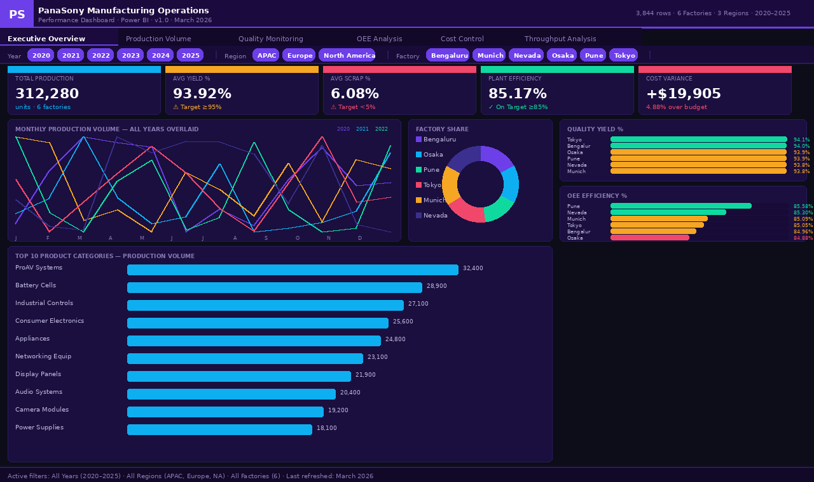
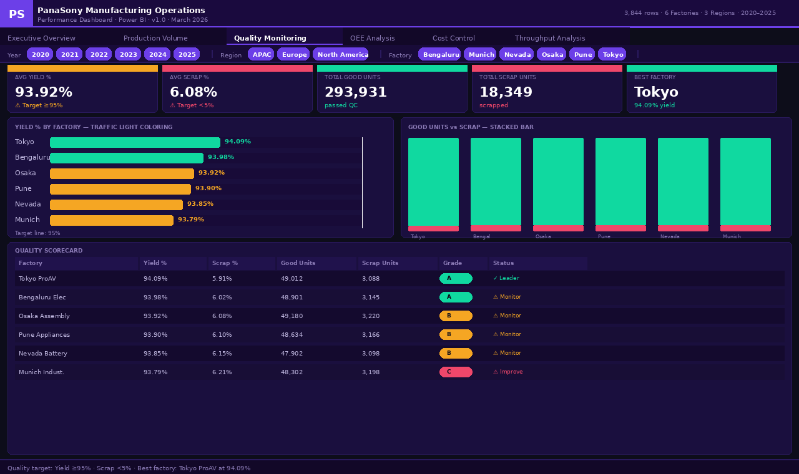
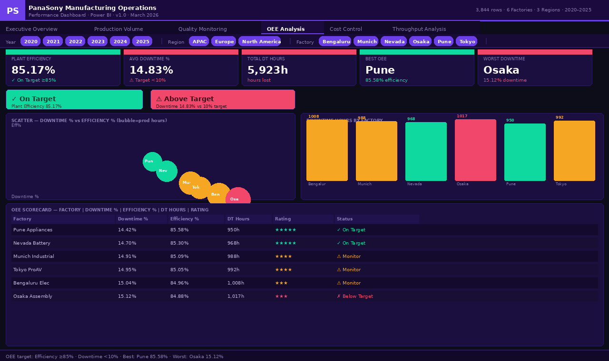
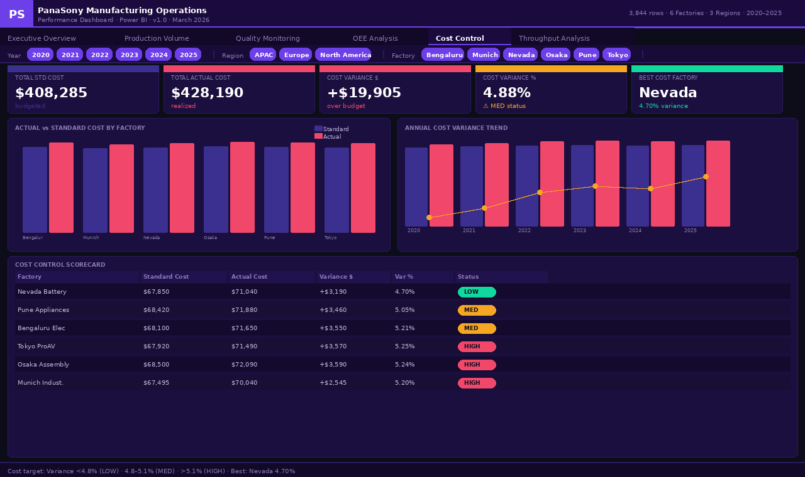

# panasony-manufacturing-dashboard
# PanaSony Manufacturing Operations Dashboard

> Power BI enterprise dashboard delivering real-time manufacturing 
> intelligence across 6 factories, 3 regions, and 5 operational domains.

---

## Overview

| Attribute | Detail |
|---|---|
| Client | PanaSony — Electronics & Manufacturing Division |
| Tool | Microsoft Power BI Desktop + Power BI Service |
| Data Source | `vw_PowerBI_FactProductionSummary` (SQL View) |
| Records | 3,844 rows × 35 columns |
| Time Period | 2020 – 2025 (6 years) |
| Factories | 6 (Bengaluru, Munich, Nevada, Osaka, Pune, Tokyo) |
| Regions | 3 (APAC, Europe, North America) |
| Report Pages | 6 (Overview, Production, Quality, OEE, Cost, Throughput) |
| Version | 1.0 — March 2026 |

---

## Business Problem

PanaSony operated 6 manufacturing facilities with no consolidated 
view of performance. Reports were Excel-based, 5–7 days out of date, 
and required IT involvement for every analysis request.

**Key gaps identified:**
- Yield % at 93.92% — 1.08% below the 95% industry target
- Downtime at 14.83% — 4.83% above the 10% target
- Cost overrun of $19,905 only discovered at month-end
- No cross-factory benchmarking — Munich's 8.22 UPH was unknown to other plants

---

## Dashboard Pages

### Page 1 — Executive Overview
5 KPI cards · Monthly trend · Factory donut · 
Quality + OEE progress bars

### Page 2 — Production Volume
Volume by Factory × Year · Monthly heatmap · 
Annual YoY comparison

### Page 3 — Quality Monitoring
Yield % traffic light · Good vs Scrap stacked bar · 
A/B/C/D grade scorecard

### Page 4 — OEE Analysis
Downtime % scatter plot · Star ratings · 
On Target / Below Target badges

### Page 5 — Cost Control
Actual vs Standard · Variance waterfall · 
LOW / MED / HIGH status scorecard

### Page 6 — Throughput Analysis
UPH vs GUPH · Annual trend · 
Efficiency ratio progress bars · HIGH/AVG/LOW banding

---

## KPI Thresholds

| KPI | Green | Amber | Red |
|---|---|---|---|
| Yield % | >= 95% | 90–95% | < 90% |
| Scrap % | <= 5% | 5–10% | > 10% |
| Plant Efficiency | >= 90% | 80–90% | < 80% |
| Downtime % | <= 10% | 10–15% | > 15% |
| Cost Variance | < 4.8% | 4.8–5.1% | > 5.1% |

---

## DAX Measures

All 40+ measures are documented in `/dax/` with full comments.

**Production:** Total Volume · Good Units · Peak Month · YoY Growth  
**Quality:** Avg Yield% · Avg Scrap% · Grade A/B/C/D · Traffic Light Colors  
**OEE:** Downtime% · Plant Efficiency% · Star Rating · Status Badges  
**Cost:** Variance $ · Variance % · LOW/MED/HIGH Status · Best Factory  
**Throughput:** UPH · GUPH · Efficiency Ratio · Band Classification  

---

## Business Impact

| Area | Before | After |
|---|---|---|
| Report generation | 2–3 days | Real-time |
| Decision making | Weekly cycle | Daily / intra-day |
| Quality issue detection | Month-end | Same shift |
| IT dependency | Every report | 100% self-service |

**Estimated annual benefit: $218,000 – $327,000**

---

## How to Use

1. Clone this repository
2. Open `powerbi/PanaSony_Dashboard.pbix` in Power BI Desktop
3. Update the data source to point to your SQL Server instance
4. Run the view script in `sql/vw_PowerBI_FactProductionSummary.sql`
5. Refresh data and publish to Power BI Service

---

## Screenshots

| Executive Overview | Quality Monitoring |
|---|---|
|  |  |

| OEE Analysis | Cost Control |
|---|---|
|  |  |

---

## Tech Stack

- Microsoft Power BI Desktop (March 2024+)
- DAX (Data Analysis Expressions)
- SQL Server / T-SQL
- Power BI Service (for publishing + scheduled refresh)
- Row-Level Security (factory-level data access)

---

## Documentation

- [Requirements & Business Problem](docs/PanaSony_Manufacturing_Dashboard.docx)
- [DAX Measures Reference](docs/PanaSony_Manufacturing_DAX_Measures.docx)

---

*Prepared by PanaSony Analytics Team · March 2026 · CONFIDENTIAL*
